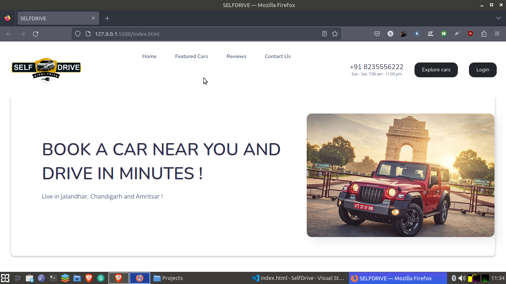

# SelfRide Car Rental

This is the README.md file for the SelfRide car rental website.

## Table of Contents
1. Getting Started
2. Features
3. Usage
4. Contributing
5. License

## Getting Started
To get started with the SelfRide car rental website, follow these steps:

1. Clone the repository
2. Install the dependencies
3. Start the development server

## Features
- User authentication
- Car rental booking
- Payment integration

## Usage
To use the SelfRide car rental website, follow these steps:

1. Sign up for an account
2. Browse available cars
3. Select a car and choose your rental period
4. Complete the payment process

## Contributing
We welcome contributions from the community. To contribute, follow these steps:

1. Fork the repository
2. Create a new branch
3. Make your changes
4. Commit your changes
5. Push your changes to your fork
6. Open a pull request

## License
This project is licensed under the MIT License.

